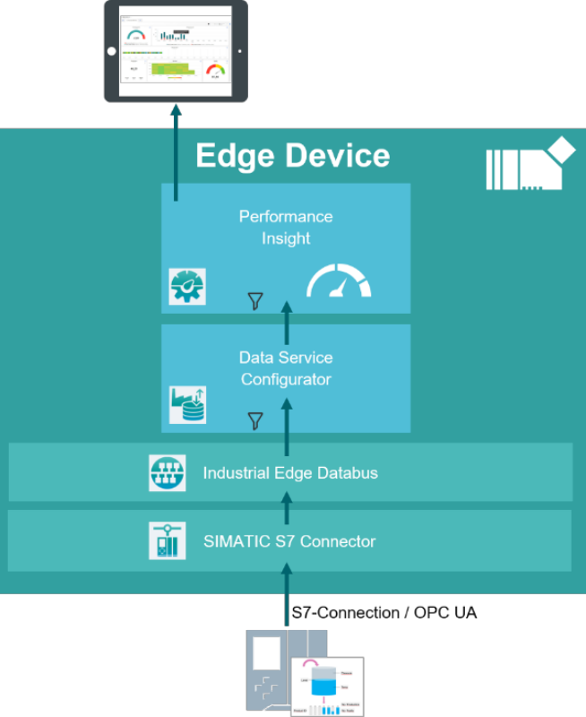

# Performance Insight application example

This example shows how to use the Industrial Edge App "Performance Insight" to visualize modeled data
- [Performance Insight](#performance-insight)
  - [Description](#description)
    - [Overview](#overview)
    - [General task](#general-task)
  - [Requirements](#requirements)
    - [Prerequisities](#prerequisities)
    - [Used components](#used-components)
    - [TIA project](#tia-project)
  - [Configuration steps](#configuration-steps)
  - [Usage](#usage)
  - [Documentation](#documentation)
  - [Contribution](#contribution)
  - [Licence and Legal Information](#licence-and-legal-information)

## Description

### Overview

This document describes how to get the data from a PLC into the Performance Insight app. The data flow goes from the S7 connector app, going through the databus app and 
being stored as time-series with the data service app. The Performance Insight app is extremely dependent on a properly configured data service app.

<kbd></kbd>

### General task

The example reads data from a PLC via the S7 Connector (OPC UA).
The data is published on the IE Databus. The Data Service monitors the bus and collect the shopfloor data.
First an adapter, providing datapoints must be assigned and configured.
Afterwards the data structure can be modeled using assets and aspects. See [data-service-how-to](https://github.com/industrial-edge/data-service-configure-s7-adapter-to-collect-data) for further explanation.
This data is collected, saved for individual time periods and transferred for further processing.

## Requirements

###  Prerequisities

- Access to an Industrial Edge Management System (IEM)
- Onboarded Industial Edge Device on IEM
- Installed System Configurators for Databus and S7 Connector
- Installed System Apps Databus and S7 Connector
- Installed Data Service
- Installed Performance Insight
- Edge device is connected to PLC
- TIA portal project loaded on PLC (e.g. for filling application)
- HTML5-capable Internet browser

### Used components

- Industrial Edge Management (IEM) V1.1.14 (OS) V1.1.0-39
  - IE Databus V1.1.15
  - IE Dat.bus Configurator V1.1.24
  - S7 Connector V1.1.23
  - S7 Connector Configurator V1.1.24
  - Data Service V1.1.3
  - Performance Insight V1.1.0
- Industrial Edge Device V 1.1.0-32
- TIA Portal V16
- S7-PLCSIM Advanced V3.0 Upd 2

### TIA Project

The used TIA Portal project can be found in the [miscellenous repository](https://github.com/industrial-edge/miscellenous) under the following name and is also used for several further application examples:

- [tia-tank-application-20201028.7z](https://github.com/industrial-edge/miscellenous/blob/main/tia-tank-application-20201028.7z)

## Configuration steps

You can find the further information about the following steps in the [docs](docs/Installation.md)
- Configure PLC Connection (Databus, S7 Connector)
- Configure Configure Data Service

## Usage

Once the Data Service app is configured and data is availalbe from a running PLC, process data can be collected.
Performance Insight visualizes this data and gives Iata insights (KPIs, metrics, etc.) 

## Documentation

You can find further documentation and help in the following links
  - [Industrial Edge Hub](https://iehub.eu1.edge.siemens.cloud/#/documentation)
  - [Industrial Edge Forum](https://www.siemens.com/industrial-edge-forum)
  - [Industrial Edge landing page](https://new.siemens.com/global/en/products/automation/topic-areas/industrial-edge/simatic-edge.html)
  
## Contribution

Thanks for your interest in contributing. Anybody is free to report bugs, unclear documenation, and other problems regarding this repository in the Issues section or, even better, is free to propose any changes to this repository using Merge Requests.

## Licence and Legal Information

Please read the [Legal information](LICENSE.md).
