# Configuration

- [Configure PLC Connection](#configure-plc-connection)
  - [Configure Databus](#configure-databus)
- [Configure Performance Insight](#configure-performance-insight)
  - [Configure OPC UA Connector](#configure-OPC-UA-connector)
- [Configure IIH Essentials](#configure-IIH-Essentials)
  - [Configure the connector](#configure-the-connector)
  - [Configure an asset with variables](#configure-an-asset-with-variables)
- [Configure Performance Insight](#configure-performance-insight)
    - [Configure a dashboard](#configure-a-dashboard)
    - [Configure widgets](#configure-widgets)
    - [Configure KPIs](#configure-KPIs)
		
# Configure PLC Connection

To read data from the PLC and provide the data, we will use OPC UA Connector to establish connection with the PLC .
The OPC UA Connector sends the data to the Databus, where the Data Service app can collect what is needed. The Performance Insight app is extremely dependent on a properly configured data service app.
In order to build this infrastructure, these apps must be configured properly:

- OPC UA Connector
- Databus
- Data Service
- Performance Insight

 
<kbd>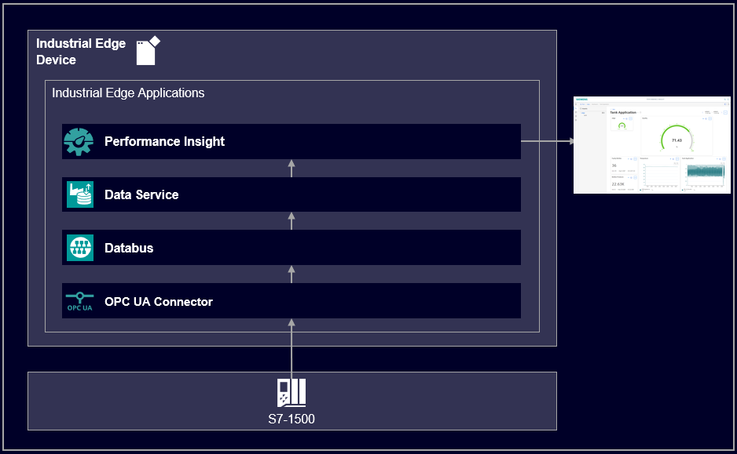</kbd>

## Configure Databus

In your IEM open the Databus and launch the configurator.

Add a user with this topic:
`"ie/#"`

<kbd></kbd>

<kbd>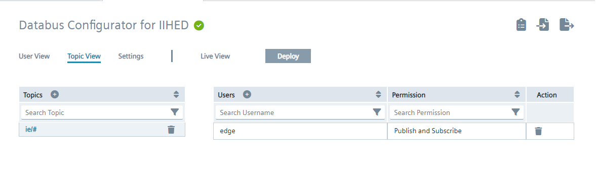</kbd>

Deploy the configuration.

## Configure OPC UA Connector

In your IEM open the OPC UA Connector and launch the configurator.

Add a data source:

<kbd></kbd>

Add needed tags:

<kbd></kbd>

Edit the settings:

<kbd></kbd>

Hint: Username and password should be the same for all system apps, e.g. "edge" / "edge".

Deploy and start the project.

# Configure IIH Essentials

In your IED Web UI open the app IIH Essentials.

Hint: If an error screen appears saying "...unauthorized...", please restart the IIH Essentials app, wait a moment and try again to open it.

## Configure the connector

On the left bar click the icon "Connectors" and choose the OPC UA Connector (MQTT).

In the settings for the connector click the edit icon on the right to open the connector configuration.

<kbd>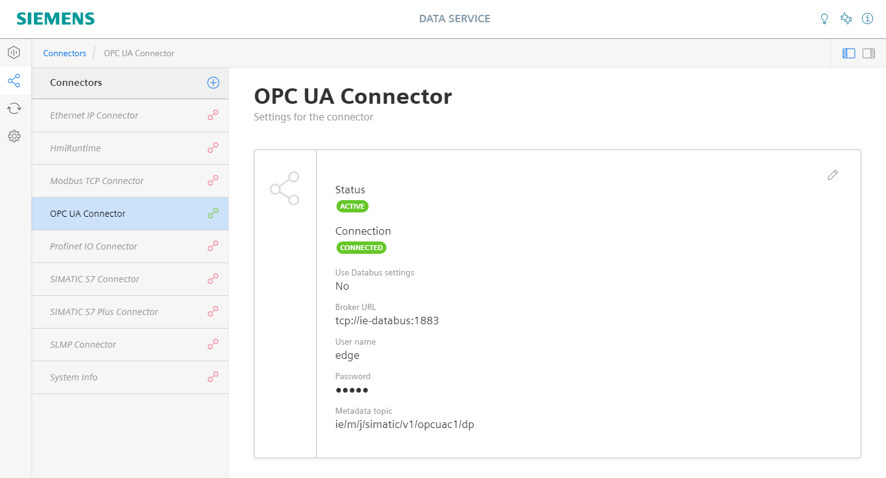</kbd>

Add the missing entries for name (OPC UA Connector) username and password (again "edge"/"edge") and use databus settings should be deactivated and save it.

<kbd>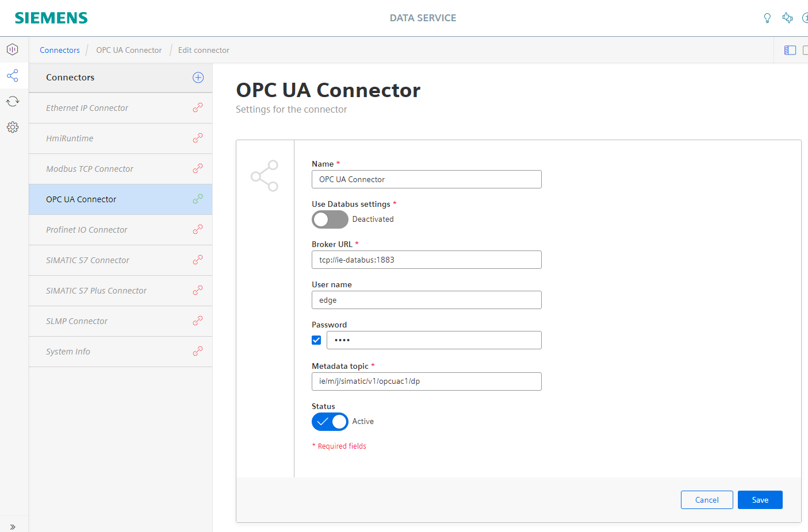</kbd>

Hint: Sometimes the Data Service app must be restarted, to take over the connector changes.

## Configure an asset with variables

On the left bar click the icon "Assets & Connectivity". For the "edge" asset you can add child assets as needed.

Choose "Add variable" or "Multiple variables" on the right side to add tags.

The required tank application variables are: tank level, tank temperature, produced bottles and faulty bottles.

<kbd>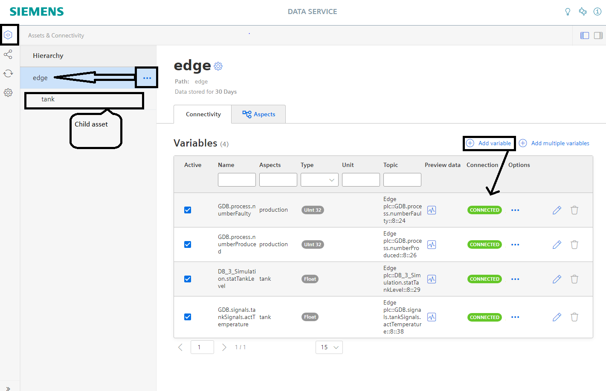</kbd>

<kbd>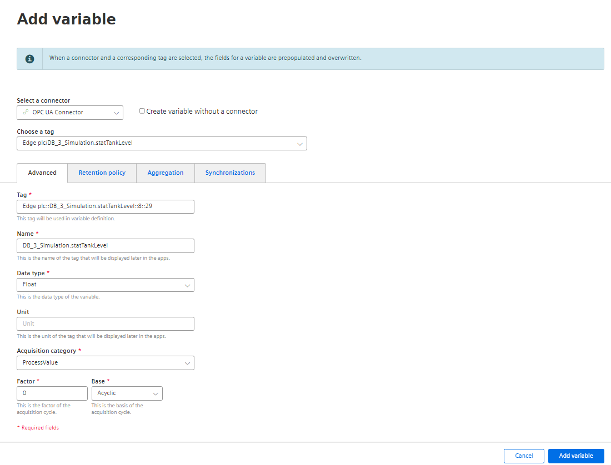</kbd>

# Configure Performance Insight

In your IED Web UI open the app Performance Insight.

<kbd>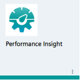</kbd>

Hint: When opening the application for the first time a lincese message might pop up (no relationship to IE Hub). Just accept the message and start using the application

## Configure a dashboard

On the my plant panel the dashboard overview will show the option to Add a new dashboard (operating at the highest hirerchical level configured in data service)

<kbd></kbd>

Insert a dashboard name and select the time period that should be display per default for all signals

<kbd>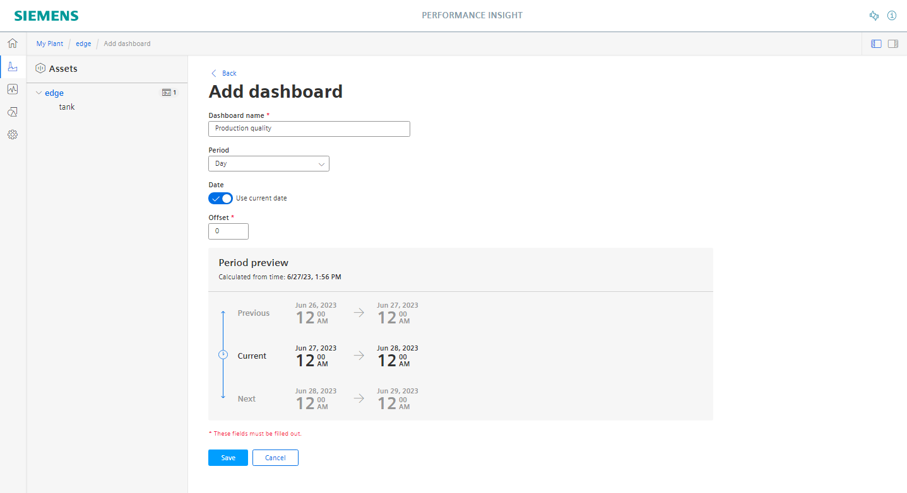</kbd>

## Configure widgets

When configuring a widget, Performance Insight offers the following types:

<kbd></kbd>

The standard widget configuration has to select some parameters

<kbd></kbd>

The following steps are to define details and display options 

In case of a Gauge Widget an additional dialog will appear with the display boundaries parametrization

<kbd></kbd>

The first widget is a gauge display for the actual production quality (with its respective warning and alarming levels)

<kbd></kbd>

Several widgets have been configured as single value display (with Min, Avg and Max Values)

<kbd>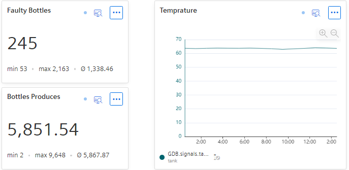</kbd>

Another configured widget is a diagram display for the actual tank level

<kbd>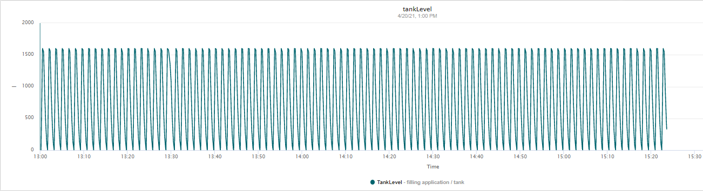</kbd>

The last used widget on this application example is a Gantt diagram. The first step is to configure a status mapping

<kbd>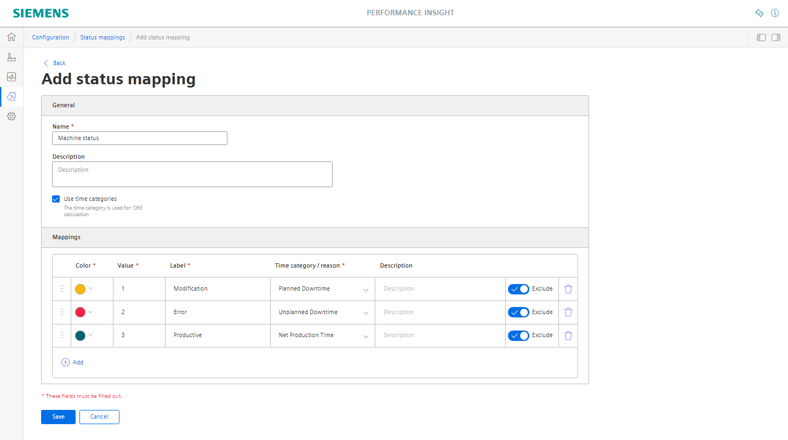</kbd>

Afterwards the Widget has to be added. The Gantt Overview will be displayed on the dashboard

<kbd>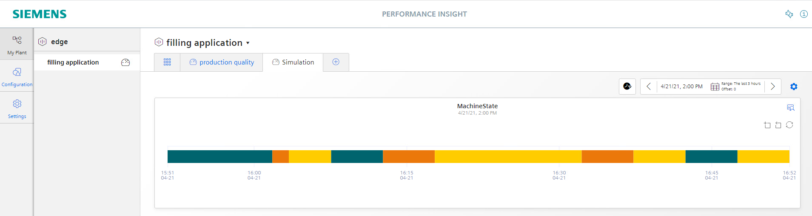</kbd>

By clicking the detailed view icon, a detailed Gantt diagram will be shown (more visible data)

<kbd>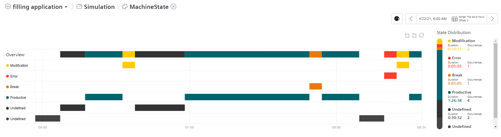</kbd>

## Configure KPIs

Additional values (also named KPIs) can be calculated out of the existing variables.

In order to calculate the production quality a KPI instance to be created 

<kbd></kbd>

This quality production KPI has been displayed using a gauge widget (frist widget mentioned). KPI has been instanced within a widget

<kbd>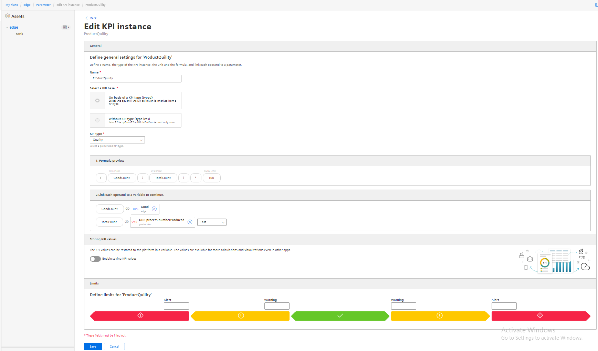</kbd>

