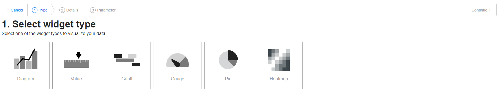
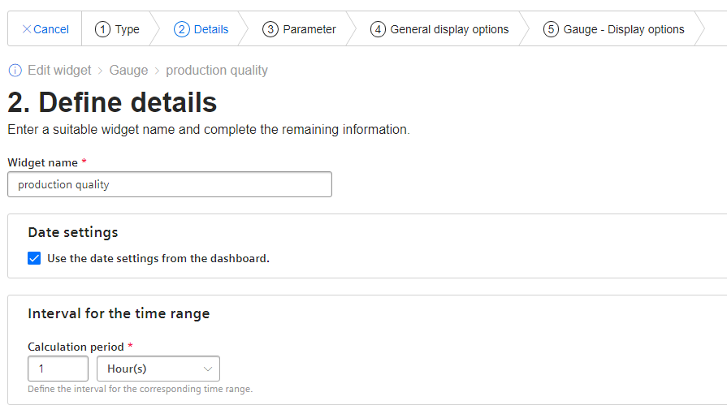
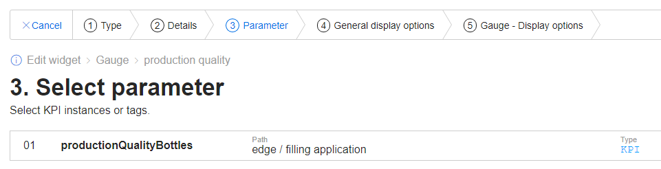
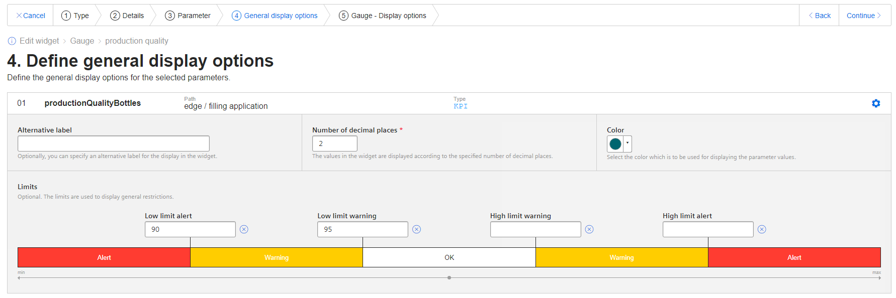
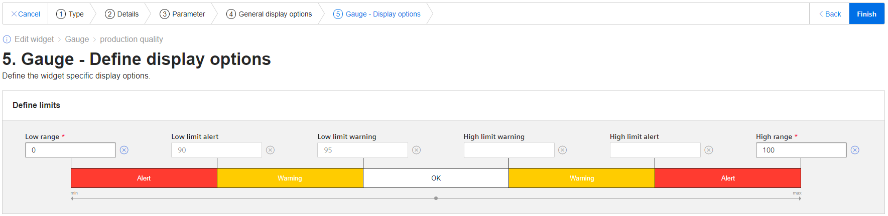

# Configuration

- [Configure PLC Connection](#configure-plc-connection)
  - [Configure Databus](#configure-databus)
  - [Configure S7 Connector](#configure-s7-connector)
- [Configure Data Service](#configure-data-service)
  - [Configure the adapter](#configure-the-adapter)
  - [Configure an asset with variables](#configure-an-asset-with-variables)
- [Configure Performance Insight](#configure-performance-insight)
    - [Configure a dashboard](#configure-a-dashboard)
    - [Configure widgets](#configure-widgets)
		
# Configure PLC Connection

To read data from the PLC and provide the data, we will use S7 Connector to establish connection with the PLC via OPC UA.
The S7 Connector sends the data to the Databus, where the Data Service app can collect what is needed.
In order to build this infrastructure, these apps must be configured properly:

- Databus
- S7 Connector

## Configure Databus

In your IEM open the Databus and launch the configurator.

Add a user with this topic:
`"ie/#"`

Deploy the configuration.

## Configure S7 Connector

In your IEM open the S7 Connector and launch the configurator.

Add a data source:

Add needed tags:

Edit the settings:

Hint: Username and password should be the same for all system apps, e.g. "edge" / "edge".

Deploy and start the project.

# Configure Data Service

In your IED Web UI open the app Data Service.

Hint: If an error screen appears saying "...unauthorized...", please restart the Data Service app, wait a moment and try again to open it.

## Configure the adapter

On the left bar click the icon "Adapters" and choose the SIMATIC S7 Connector (MQTT).

Click the edit icon on the right to open the adapter configuration.

Add the missing entries for username and password (again "edge"/"edge") and save it.

Hint: Sometimes the Data Service app must be restarted, to take over the adapter changes.

## Configure an asset with variables

On the left bar click the icon "Assets & Connectivity". For the "edge" asset you can add child assets as needed.

Choose "Create first variable" or "Add variable" on the right side to add tags.

The required tank application variables are: tank level, tank temperature, produced bottles and faulty bottles.

# Configure Performance Insight

In your IED Web UI open the app Performance Insight.

Hint: When opening the application for the first time a lincese message might pop up (no relationship to IE Hub). Just accept the message and start using the application

## Configure a dashboard

On the main panel the dashboard overview will show the option to create a new dashboard (operating at the highest hirerchical level configured in data service)

Insert a dashboard name and select the time frame that should be display per default for all signals

## Configure widgets

When configuring a widget, Performance Insight offers the following types:

The standard widget configuration has to define some details

The following steps are: select parameters and define display options 

The first widget is a gauge display for the actual production quality (with its respective warning and alarming levels)

Several widgets have been configured as single value display (with Min, Avg and Max Values)

The last widget is a diagram display for the actual tank level

In order to calculate the production quality a KPI type has been defined

This quality production KPI has been displayed using a gauge widget (frist widget mentioned). KPI has been instanced within a widget

